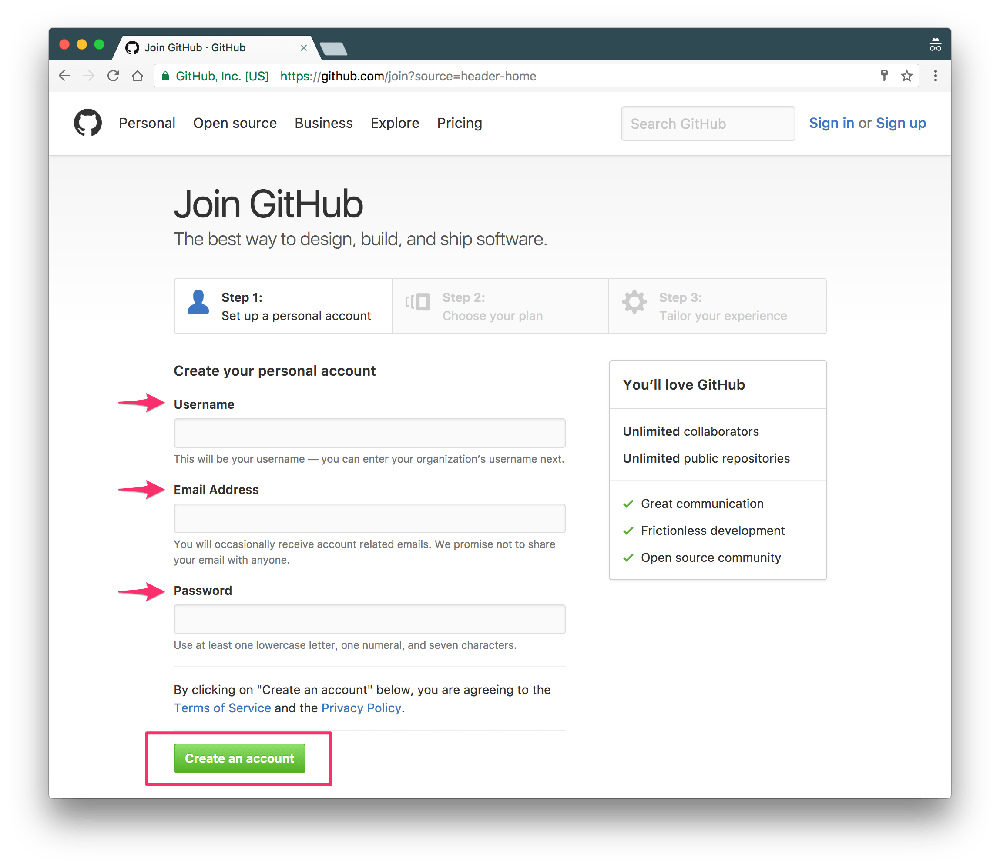
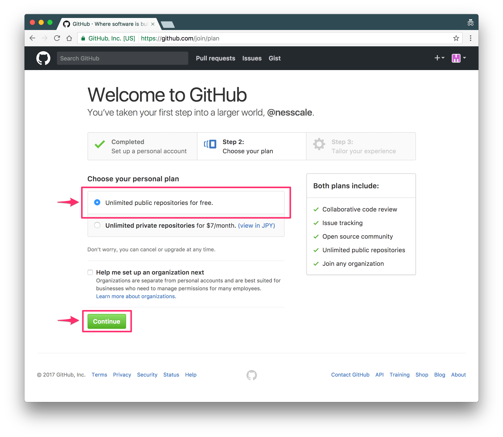
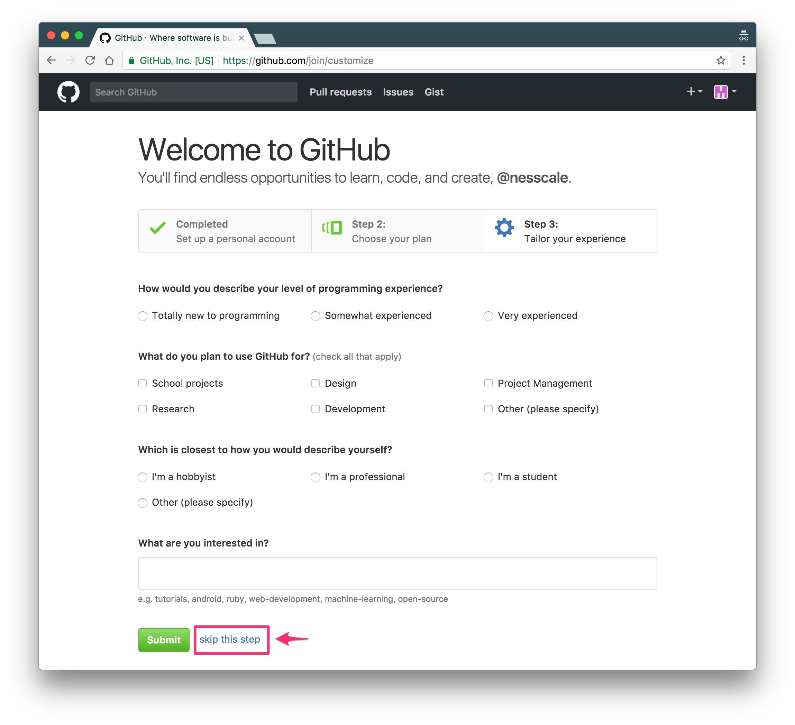
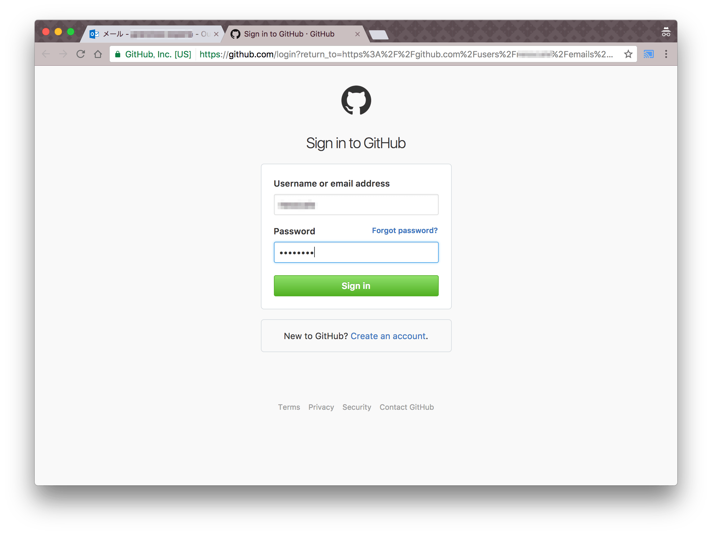

# アカウントを作る

早速、GitHubのアカウントを作りましょう。

## 作り方

まずはGitHub( https://github.com/ )のページにアクセスします。
右上の "Sign up" をクリックします。

サインアップページが表示されます。

それぞれの入力欄に文字を入力します。

- Username
  - GitHubでのユーザ名を決めて、入力しますです。通常自分のHNなどを入力します。
  - Webページアドレスの名前にもなります。
    - 例えば `github` の場合は、 `https://github.github.io/` のようなURLになります。
    - 作品を公開するときは、おそらく `https://github.github.io/sakuhin-name` のようになります
  - もし世界中の誰かが同じ Username を使っていた場合、別の Username にする必要があります。
  - **一度決めると変更できません！**
- Email Address
  - メールアドレスを入力します。
  - 間違えないように入力しましょう！
- Password
  - GitHubへログインするときのパスワードです。
  - 必ず忘れないように、紙に書くなどして覚えておきましょう！
  - 8文字より少ない Password を使えません。

全て入力し終わったら、 `Create an account` をクリックして次に進みましょう！

次は、プランの選択画面が出ます。

無料で使いたいので、 `Unlimited public repositories for free.` を選びます。

続けて、 `Continue` を押して次に進みます。するとアンケート画面が表示されます。

飛ばせるので、そのまま先に進みましょう。

## メールアドレスの確認

GitHubが、入力したメールアドレスが正しいものなのかどうかを確認したいと言っています。

先程のアンケート画面で `Start Project` をクリックするとこの画面が表示されます。

この画面が表示されたときには、入力したメールアドレスにメールが届いていると思います。その中にあるリンクをクリックしましょう。

下記画面は、メール確認画面の例です。

クリックすると、ログインして欲しいと言われるときがあります。その時はログインしましょう。

これでメールアドレスの確認と、GitHubアカウントの作成は完了です！

続けて、Webページを作ってみましょう。

