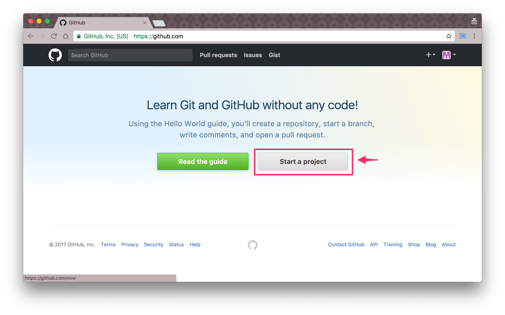
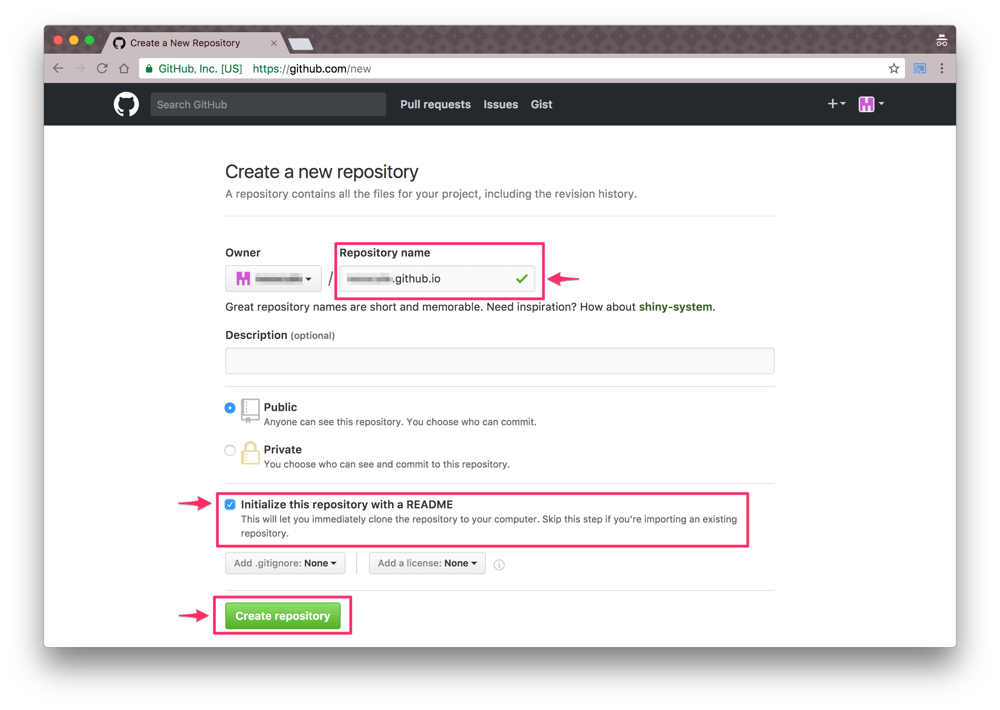
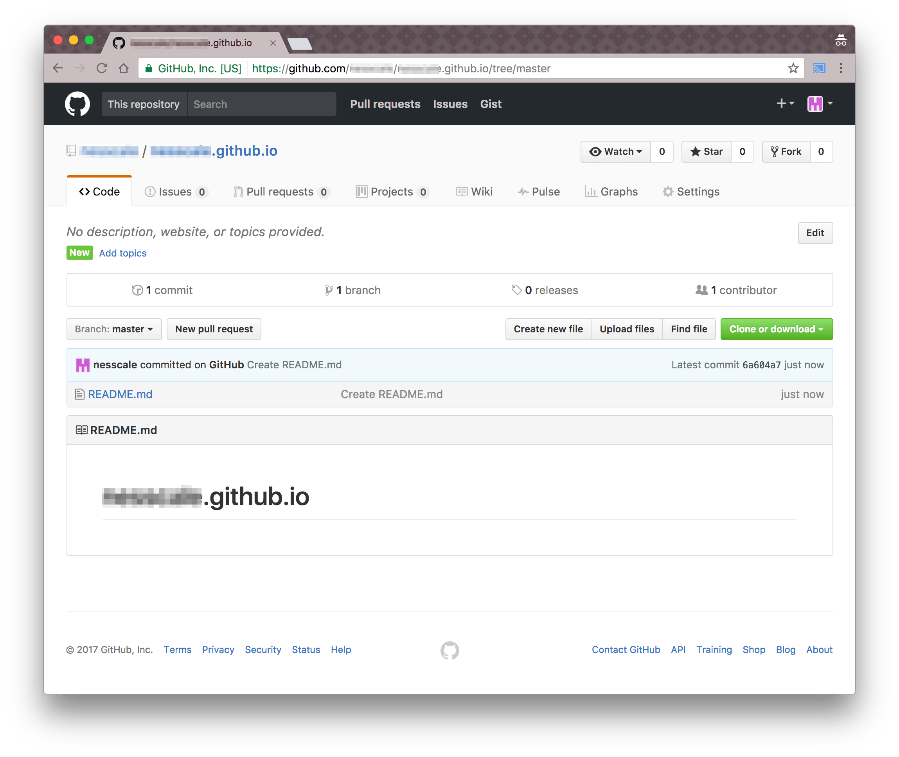
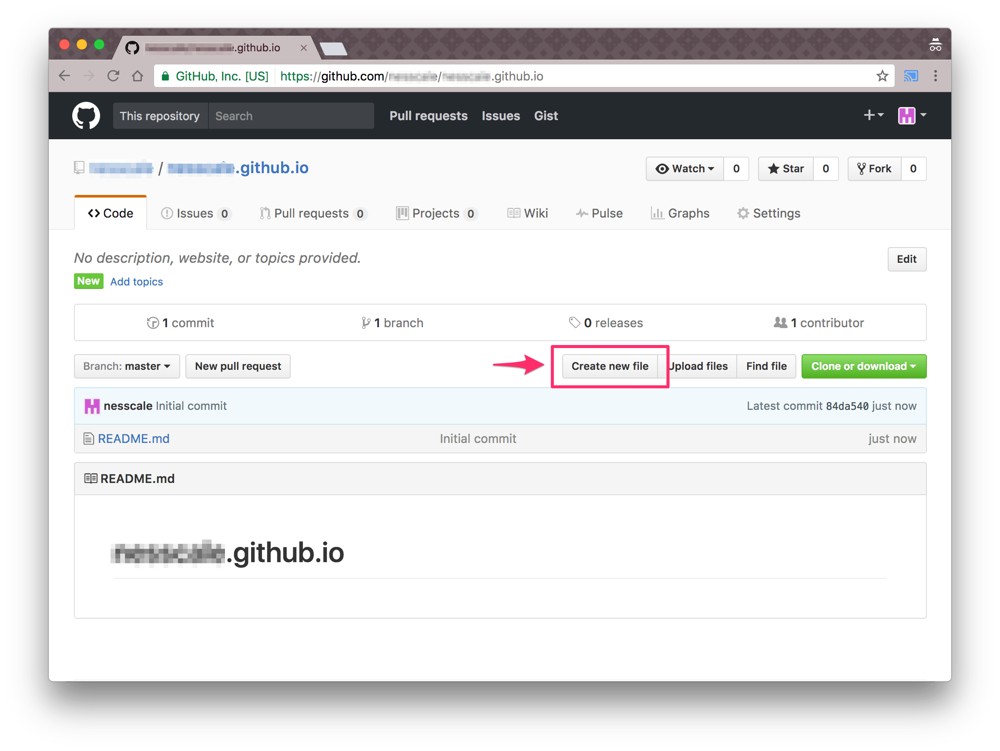
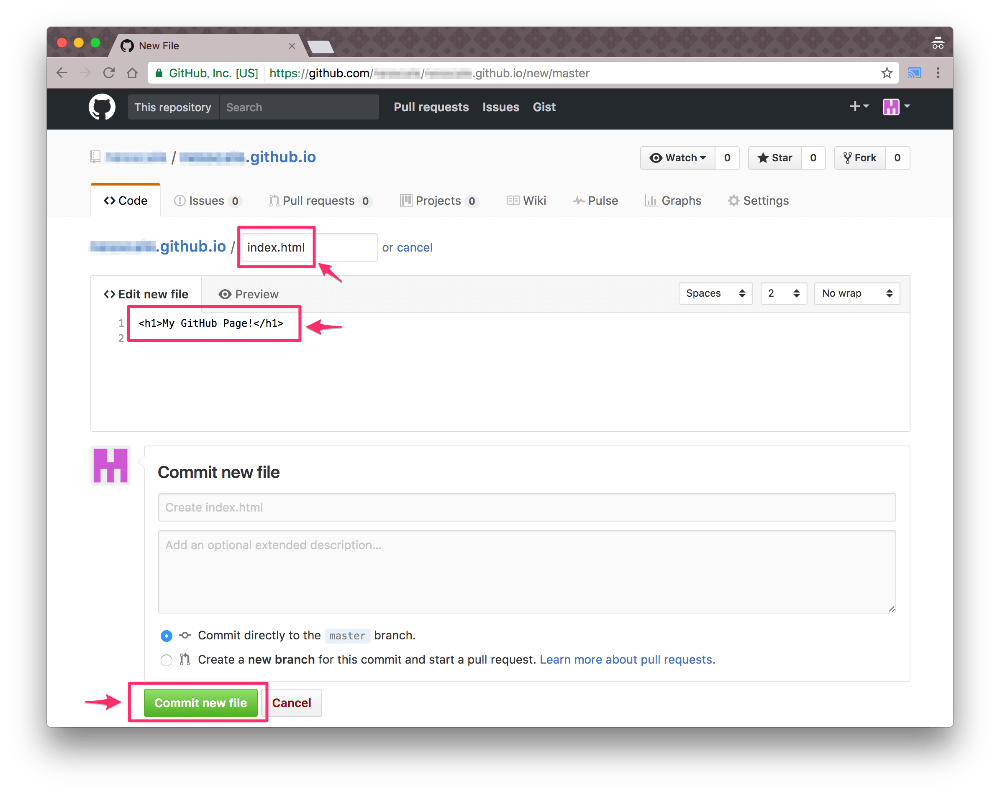

# Webページの作り方

## リポジトリを作る

GitHubで、自分のWebページを公開してみましょう。

まずは、以前作ったアカウントでログインします。

そして、 https://github.com/ にアクセスし、 `Start project` をクリックしましょう。

次に、Webページ用プロジェクトを作ります。

上記ページで、それぞれの入力欄に文字を入力します。

- Repository name
  - `"Username".github.io` という名前で入力しましょう。
  - 例えば、 Username が google だとすると、 `google.github.io` となります。
- `Initialize this repository with a README` にチェックを入れる
  - **必ず入れましょう！** 後でちょっと違う画面が出てしまいます！

入力し終わったら `Create repository` をクリックしましょう。

Webページの入れ物の出来上がり！

## 最初のページを作ろう

入れ物が出来たので、続けて自分の最初のページを入力しましょう。

まず、 https://github.com/Username/Username.github.io/ にアクセスしましょう。 `Username` は自分のユーザー名にしましょう。

そして、 `Create new file` をクリックします。

ファイルの内容を入力する画面が表示されます。

それぞれ、入力していきましょう。

- `Username.github.io / [    ] or cancel`
  - 一番上の欄です。ここにファイル名を入れます。
  - **今回は `index.html` と入れましょう！**
- `Edit new file`
  - ファイルの内容を入力します。
  - 今回は `<h1>My GitHub Page!</h1>` と入力しましょう。

入力が終わったら、 `Create new file` をクリックしましょう。

これで最初のページは完成です！ https://Username.github.io/ にアクセスしてみましょう(Usernameは自分のユーザー名)。

## もっといろんなことをしてみる

きっとこんな要望が出るでしょう：

- ファイルを編集したい
  - https://github.com/Username/Username.github.io/ にアクセスしましょう。
  - 編集したいファイルを選択します。
  - ファイルの内容が表示されます。そこに **鉛筆マーク** があるのでクリックしましょう。
- フォルダを作りたい
  - 注) GitHubでは、フォルダだけ作ることはできません！
  - https://github.com/Username/Username.github.io/ にアクセスしましょう。
  - `Create new files` というボタンを押しましょう。
  - ファイル名を入力するところに、 `my_folder/index.html` と入力しましょう。
- JavaScriptを使いたい
  - 作成した `index.html` に、いつものようにJavaScriptを書いてみましょう！そして、 https://Username.github.io/ にアクセスしましょう。
- 画像を使いたい
  - https://github.com/Username/Username.github.io/ にアクセスしましょう。
  - `Upload files` というボタンを押しましょう。
  - その上に、好きな画像をドラッグアンドドロップしましょう。
  - 終わったら、 `Commit changes` をクリックしましょう。

Happy Coding!

